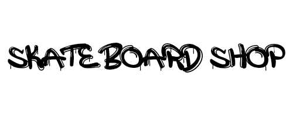

 

> <h3 style="text-align:center"><i> Este é um Projeto para fins de estudo.</i></h3>

  

#### **SkateShop** é um E-commerce voltado para o público skatista. Então nesta loja é vendido produtos como:

- Roupas
    - Camiseta
    - Camisa
    - Moletom
    - Jaqueta
    - Calça
    - Bermuda
- Tênis
- Acessórios
    - Boné
    - Meia
    - Gorro
    - Mochila
    - Carteira
    - Chaveiro
- Peças para Skate

#### Todos produtos são de marcas consolidadas no mercado de skate com alta qualidade.

***

    
    

***

 

     
    <h2>&nbsp; Tecnologias</h2>

 

#### Este Projeto foi desenvolvido utilizando as seguintes Tecnologias:

- PHP
- HTML
- CSS
- JAVASCRIPT
- JSON
- COMPOSER
- WEBSERVICE VIACEP (para validar cep informado pelo usuário)
- API DE PAGAMENTOS

#### Desenvolvido com a versão mais recente do PHP no momento, versão 7.4.6

***

 

     
    <h2>&nbsp; Design Pattern</h2>

 

#### Foi aplicado padrão de projeto para que o código tenha maior durabilidade e facilidade na manutenção. Design Pattern utilizado:

&nbsp;&nbsp;&nbsp;&nbsp;
 
&nbsp;
MVC (MODEL - VIEW - CONTROLLER)

 

#### Nele é divido o projeto em 3, o Model é responsável em fazer a comunicação com o Banco de Dados, Já o View, exibir a parte visual e interativa com o usuário, No caso do Controller, ele será uma peça importante para que este Design Pattern funcione, o Controller será um intermediador entre Model e View, ele pegará os dados fornecidos pelo usuário no View e enviará para o Model, a resposta dada pelo Model será enviada para o View. Assim o usuário verá o resultado final.